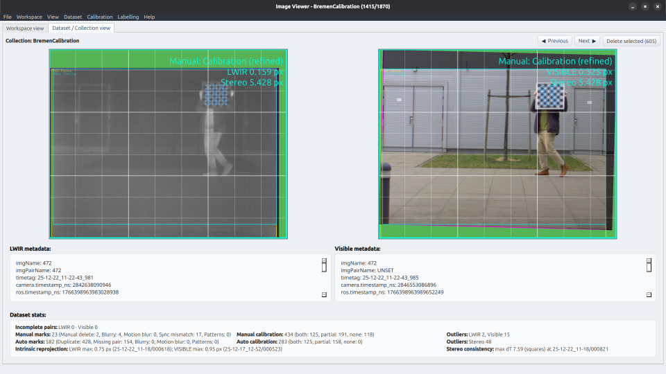

# Multiespectral Check GUI

GUI for multispectral dataset review, calibration, and labeling for detection tasks.



## ⚙️ Requirements

- **OS**: Linux (tested on Ubuntu 24.04 and 20.04)
- **Python**: >= 3.12
- Main dependencies: PyQt6, OpenCV, NumPy (see `requirements.txt` for full list)

## 🚀 Installation

It is recommended to work in a virtual environment so that dependencies match. [UV](https://docs.astral.sh/uv/) is a nice match for that and allows easy management of different Python versions along with their dependencies.

```sh
# Clone the repository
git clone https://github.com/enheragu/multiespectral_check.git
cd multiespectral_check

# Install UV package manager
curl -LsSf https://astral.sh/uv/install.sh | sh

# Install Python 3.12 and create virtual env
uv python install 3.12
uv venv --python 3.12 .venv
source .venv/bin/activate
python --version  # Should show 3.12.x

# Install dependencies
uv pip install -r requirements.txt
```

## ▶️ Usage

The main entry point is `src/main.py`. Although it can be executed directly, it is recommended to use `scripts/run_debug.sh`, which enables extra logging stored into a file along with coverage tools. This way any error or crash can be better debugged.

From the root directory of the repository:
```sh
source scripts/run_debug.sh
```

### First steps with the GUI

1. **Set a workspace**: Open a folder containing your datasets/collections. The workspace panel shows dataset statistics at a glance.
2. **Open a dataset**: Double-click a dataset in the workspace table or use Dataset > Load dataset.
3. **Browse images**: Use ← / → arrows or Space to navigate LWIR/Visible pairs.
4. **Filter & clean**: Run sweep tools (Dataset > Detect delete candidates) to flag duplicates, missing pairs, or blurry images. Review and tag manually via right-click or keyboard shortcuts. ⚠ Blur/motion sweep is still experimental.
5. **Calibrate**: If you have calibration images (with chessboard), use the Calibration menu to detect corners, compute intrinsic/extrinsic matrices, and check the calibration report. Different view settings (undistort, stereo alignment) become available after calibration.
6. **Label**: Configure a detection model and labels YAML (Labelling menu), then run automatic labelling on individual images or the full dataset. Manual labelling mode (Ctrl+L) lets you draw and edit bounding boxes directly.

## 📁 Dataset expected structure

Once the GUI is started, a Workspace can be loaded. A workspace is a folder that contains one or more collections of sets. Each collection can contain one or more sets, and each set contains the actual images and metadata. The expected structure is as follows:

```text
workspace/
├── collection1/          # Groups related datasets
│   ├── set_a/        # LWIR + Visible synchronized pairs
│   │   ├── lwir/
│   │   │   ├── img_001.png
│   │   │   ├── img_001.yaml (metadata)
│   │   │   └── ...
│   │   └── visible/     # Same structure
│   └── set_b/
└── standalone_set/  # Treated as single-set collection
```

Note that collections are optional and can be used to group specific sets (all calibration sets, all daylight sets, etc). If a set is not inside a collection, it will be treated as a single-set collection.

## ✨ Core features

- ✅ Review multispectral datasets (two synchronized images).
- ✅ Handle big datasets split as multiple sets grouped as collections inside a workspace. Share calibration and useful configuration within the workspace.
- ✅ Filter common image problems by automatic search (duplicates, missing pairs, calibration patterns) and manual tagging (problems in synchronization, blurry images, etc). ⚠ Blur/motion detection is still experimental.
- ✅ Tag calibration image pairs (those with chessboard pattern) either manually or through calibration search sweep. Chessboard detection with subpixel corner adjustment (not always better, check thoroughly).
- ✅ Generate intrinsic and extrinsic calibration, with option to filter outliers (auto-detected or manually selected) to refine calibration.
- ✅ Different options to check image rectification to match images field of view through calibration.
- ✅ Manual labelling with bounding box drawing, class selection (autocomplete), and per-label editing/deletion. Check `config/labels_mmultiespectral_dataset.yaml` for an example of label configuration.
- ⏳ [TBD] Automatic label suggestion using configurable detection models. Run on individual images or batch across the full dataset.
- ⏳ [TBD] Dataset statistics and visualization of label distribution.
- ⏳ [TBD] Dataset export with matching images and specific label format (YOLO, PascalVOC, etc).
- ⏳ [TBD] Coverage and log for debug tracking and code quality control.


## 📚 Extra documentation

- [GUI_FUNCTIONALITIES.md](docs/GUI_FUNCTIONALITIES.md) — Detailed information about the functionalities included in the GUI.
- [DESIGN_PHILOSOPHY.md](docs/DESIGN_PHILOSOPHY.md) — Design and coding philosophy followed in this project.

## 🐛 Bug reports & Contact

If you find a bug or have a feature request, please [open an issue](https://github.com/enheragu/multiespectral_check/issues) on GitHub or contact the maintainer via [email](mailto:e.heredia@umh.es).

For general questions, feel free to reach out via the repository's issue tracker.
