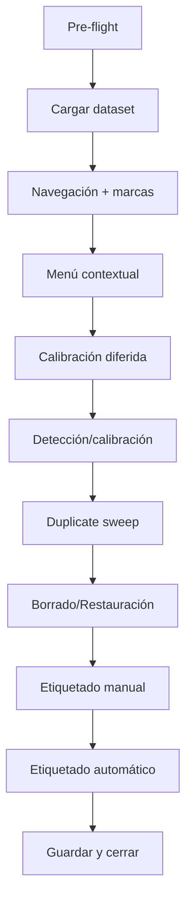

# Manual Test Plan

Secuencia sugerida para validar el visor y los refactors recientes.

## Pre-flight
- Dataset de prueba con imágenes en `lwir/` y `visible/` y algunos marcados de calibración/duplicados previos en cache.
- Arrancar app vía `python -m src.main` (o método habitual).
- Verificar que no hay diálogos modales abiertos al inicio.

## Flujo principal
1. **Carga y estado inicial**
   - Cargar dataset desde `Dataset → Load dataset` y confirmar que botones Next/Prev quedan habilitados.
   - Ver que los metadatos de ambos canales se muestran y cambian al navegar.
2. **Navegación y marcas**
   - Navegar con ← → y barra espaciadora; comprobar que el título refleja índice y filtro (si aplica).
   - Pulsar `Delete` para alternar marcado manual; comprobar contador en botón "Delete selected" y overlays.
   - Usar atajos de motivo (Ctrl+Shift+D/B/M/S, etc.) para alternar motivos; repetir vía menú contextual y verificar mismo resultado.
3. **Menú contextual**
   - Click derecho en cada vista → seleccionar Previous/Next; confirmar navegación.
   - Marcar/desmarcar candidato a calibración y comprobar overlay, stats y filtro (si había filtro activo).
   - Con imagen marcada para calibración, elegir "Re-run calibration detection" y observar mensaje de estado.
4. **Cola de calibración diferida**
   - Marcar rápidamente varias imágenes para calibración (con atajo `Ctrl+Shift+C` o menú contextual) y detener en una tercera.
   - Tras ~0.2s, verificar que se encolaron detecciones (barra de progreso y stats se actualizan a medida que llegan resultados).
5. **Detección/calibración**
   - Ejecutar "Calibration → Detect chessboards"; confirmar progreso y botón de cancelar.
   - Tras finalizar, abrir "Check calibration report" y revisar que datos existen.
6. **Barrido de duplicados (firmas)**
   - Ejecutar "Dataset → Run duplicate sweep"; comprobar barra de progreso y que el botón cancelar responde.
   - Navegar durante el barrido: las imágenes visitadas deben mostrar overlays actualizados cuando llegue la firma.
   - Repetir el barrido forzado y confirmar que si todo está cacheado muestra mensaje de cache.
7. **Borrado/restauración**
   - Marcar varias imágenes y usar "Delete selected"; verificar contador en menú Restore y que desaparecen según filtro.
   - Usar "Restore from trash" para volver a estado anterior.
8. **Etiquetado manual**
   - Activar "Manual labelling mode"; dibujar caja en cada canal, elegir clase desde el diálogo con autocompletado.
   - Cancelar con `Esc`; borrar una caja con click derecho.
   - Desactivar modo manual y verificar que las cajas permanecen cuando "Show labels" está activo.
9. **Etiquetado automático (si procede)**
   - Configurar modelo y YAML, ejecutar "Run labelling on current"; comprobar etiquetas y overlays.
10. **Guardado y salida**
    - `Ctrl+S` o "Save current status"; cerrar la app y volver a abrir para confirmar que estado, filtros y preferencias persisten.

## Diagrama de orden sugerido

## Notas rápidas
- Si algún progreso queda colgado, usa el botón de cancelar de la barra superior.
- Revisa la consola para mensajes de depuración de calibración cuando exportas overlays o debug bundles.
- Para datasets muy pequeños, algunos pasos (duplicate sweep, calibración diferida) pueden terminar demasiado rápido; repetir con más imágenes si hace falta.
